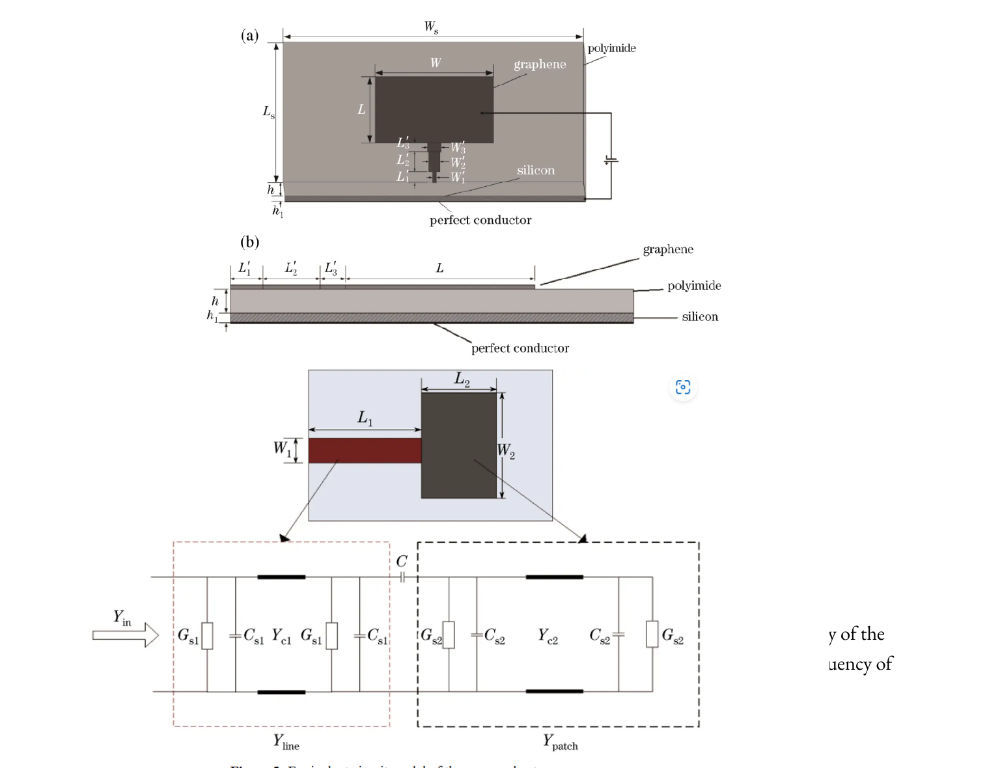
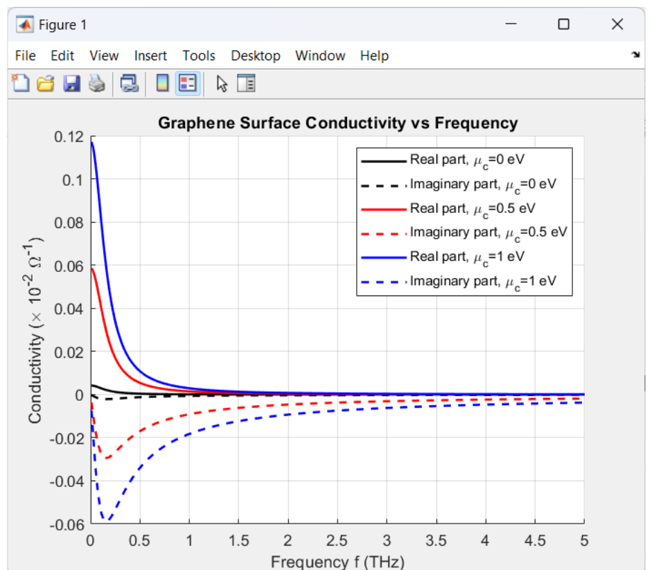
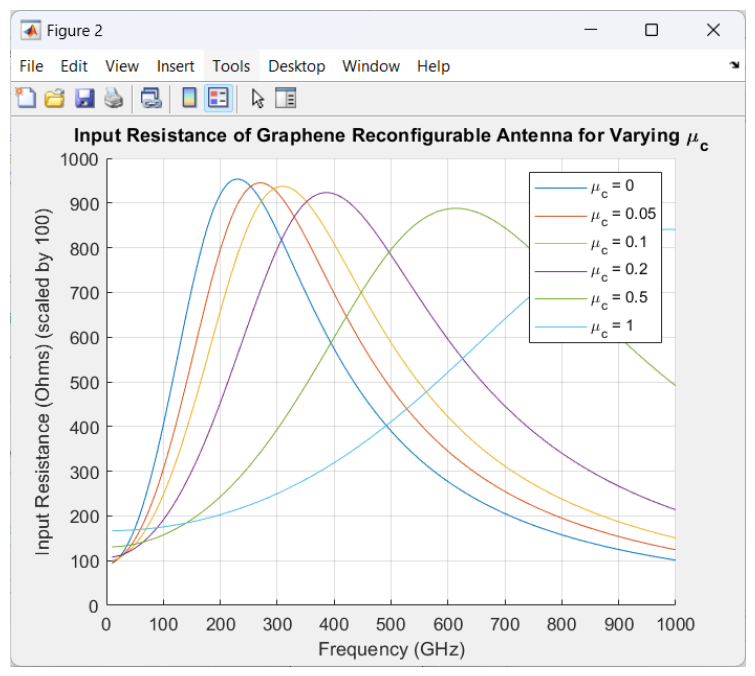
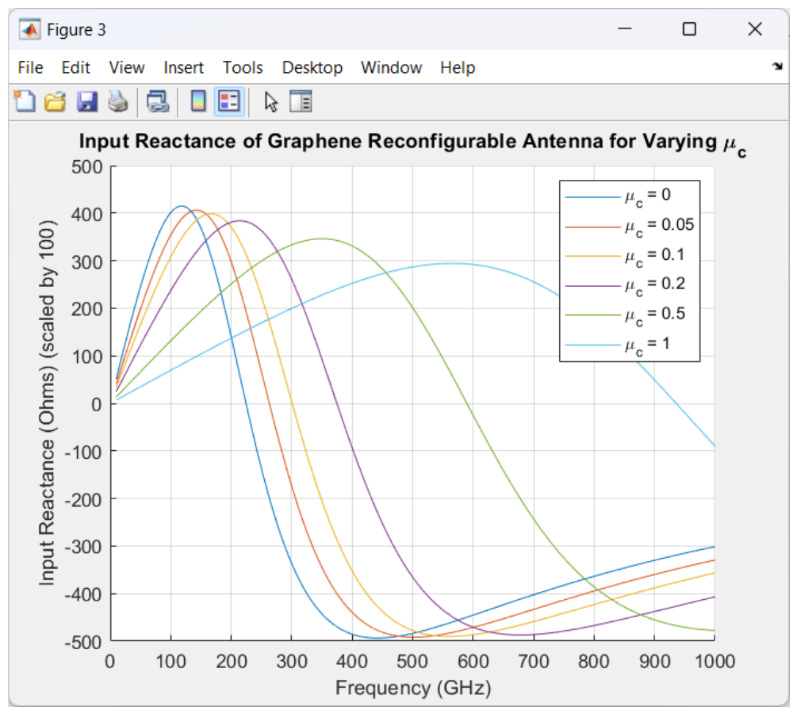
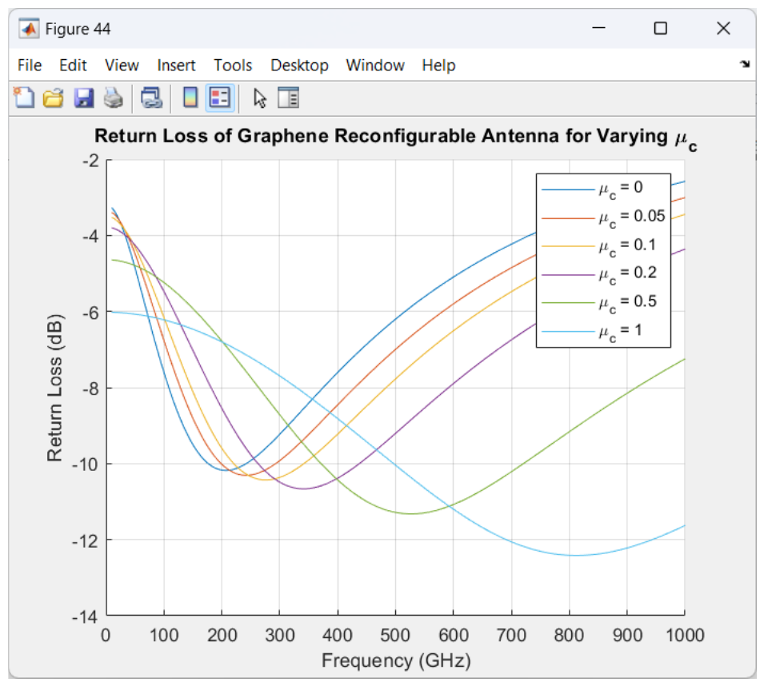
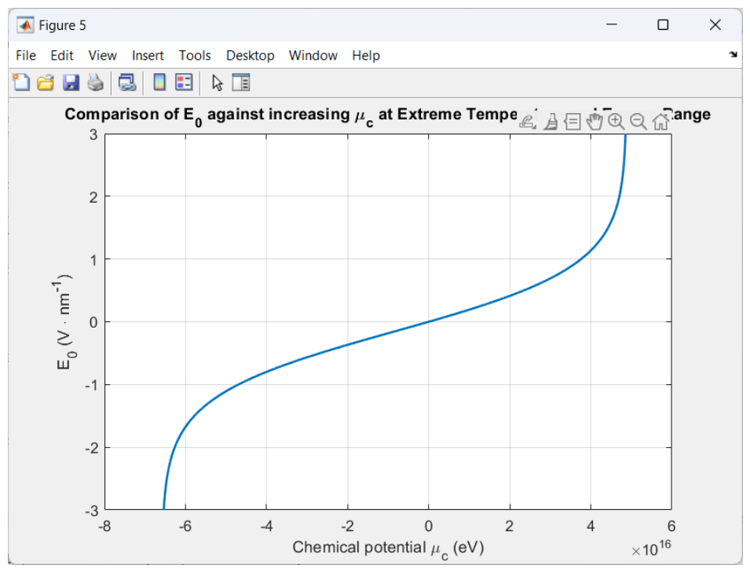

# Reconfigurable Graphene-Based THz Antenna

A frequency-reconfigurable microstrip patch antenna for terahertz (THz) wireless communication, using graphene's electrically-tunable surface conductivity instead of fixed metal conductors. Tuning the chemical potential (μ<sub>c</sub>) of the graphene patch via an external bias shifts the antenna's resonant frequency — no physical reconfiguration needed.

Full write-up (theory, design, and analysis) is in [`report/`](./report).

## Why Graphene

Conventional metals give THz antennas a fixed resonant frequency and suffer from high ohmic losses at these frequencies. Graphene's surface conductivity, by contrast, can be tuned dynamically by varying its chemical potential through an applied bias field — so the same physical patch can be re-tuned electrically instead of being redesigned. This project models that tunability and validates it in simulation across **695.55–705.05 GHz**.

## System Overview


| Block | Role |
|---|---|
| Input Signal Source | THz excitation source |
| Transmission Line | Impedance matching between source and patch |
| Bias Voltage Control | Sets graphene's chemical potential (μ<sub>c</sub>) via applied field |
| Graphene Radiation Patch | The tunable radiating element |
| Polyimide Substrate | Low-dielectric-loss support layer |
| High Resistivity Silicon | Base substrate |
| Ground Plane | Suppresses back radiation |

## Antenna Structure & Equivalent Circuit

Top view (a) and side view (b) of the patch, plus the lumped equivalent-circuit model (graphene patch modeled as a variable admittance in parallel with the transmission line and coupling capacitor):



## Theory

Graphene's surface conductivity is governed by the Kubo formula; in the THz band the **intraband (Drude) term** dominates:

```
σ_intra(ω, T, μc) = ( -i e² k_B T / (π ℏ² (ω − iΓ)) ) · ( μc/(k_B T) + 2 ln(e^(−μc/k_B T) + 1) )
```

where `ω` is angular frequency, `T` is temperature, `μc` is chemical potential, `e` is electron charge, and `k_B`, `ℏ` are the Boltzmann and reduced Planck constants. This conductivity feeds directly into the equivalent-circuit admittance, which determines the antenna's input impedance and, from there, its resonant frequency and return loss.

## Repository Structure

```
.
├── matlab/
│   ├── graphene_conductivity_vs_frequency.m   # Figure 1
│   ├── input_impedance_return_loss.m          # Figures 2, 3, 4
│   └── e0_vs_chemical_potential.m             # Figure 5
├── docs/
│   └── images/                                # Schematics + plots (used in this README)
├── report/
│   └── lab_project_report.pdf
└── README.md
```

## Running the Simulations

Each script is standalone — open in MATLAB and run:

```matlab
graphene_conductivity_vs_frequency   % surface conductivity vs frequency, varying mu_c
input_impedance_return_loss          % input resistance, reactance, return loss, varying mu_c
e0_vs_chemical_potential             % E0 field vs chemical potential at extreme temperature
```

No toolboxes beyond base MATLAB are required (`integral`, `arrayfun`, and standard plotting).

## Results

### Graphene Surface Conductivity vs Frequency

Real and imaginary parts of σ for μ<sub>c</sub> = 0, 0.5, 1 eV. Higher chemical potential raises the real (lossy) part at low frequency, then converges as frequency increases.



### Input Resistance vs Frequency

Varying μ<sub>c</sub> shifts the resistance peak — and therefore the resonant point — across the sweep.



### Input Reactance vs Frequency



### Return Loss vs Frequency

Return loss exceeds 10 dB across multiple resonant points, confirming acceptable tuning across the target THz range as μ<sub>c</sub> varies.



### E₀ vs Chemical Potential (Extreme Temperature)



## Summary of Findings

- Tunable resonance achieved across **695.55–705.05 GHz** by varying graphene's chemical potential.
- Increasing μ<sub>c</sub> decreases the real part of input impedance while the imaginary part stabilizes at high frequency — better resonance matching.
- Return loss > 10 dB at multiple resonant points across the swept range.
- Maximum radiation gain of **6.92 dBi** with radiation efficiency **> 86%**.

## Future Work

- Explore alternative/hybrid substrates to broaden the tunable frequency range.
- Optimize the bias control circuit for lower power consumption.
- Experimental validation under real-world and varying-temperature conditions.

## References

- Saraereh, O. A., Al-Tarawneh, L., Ali, A., & Al Hadidi, A. M. "Design and Analysis of a Novel Antenna for THz Wireless Communication." *Intelligent Automation & Soft Computing*. DOI: [10.32604/iasc.2022.020216](https://doi.org/10.32604/iasc.2022.020216)
- Kaul, R. "Microwave engineering." *IEEE Potentials*, vol. 8, no. 2, pp. 11–13, 1989.

## Group

- T K Sreevatsa Murthy (B210656EC)
- Thondepu Moushmi (B210745EC)
- Thota Goutham Goud (B210740EC)
- Uday Jinna (B210674EC)
